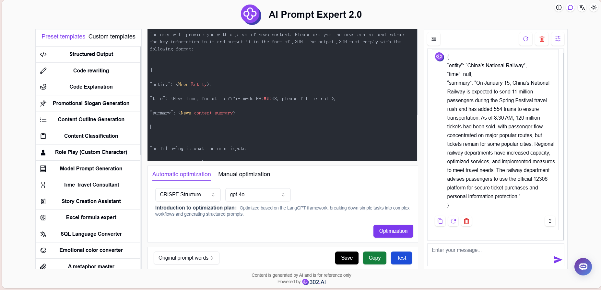
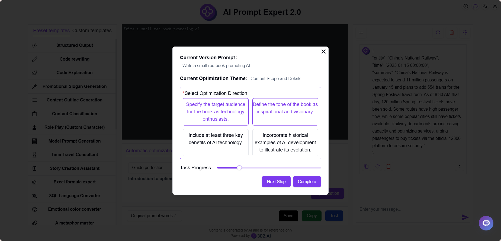
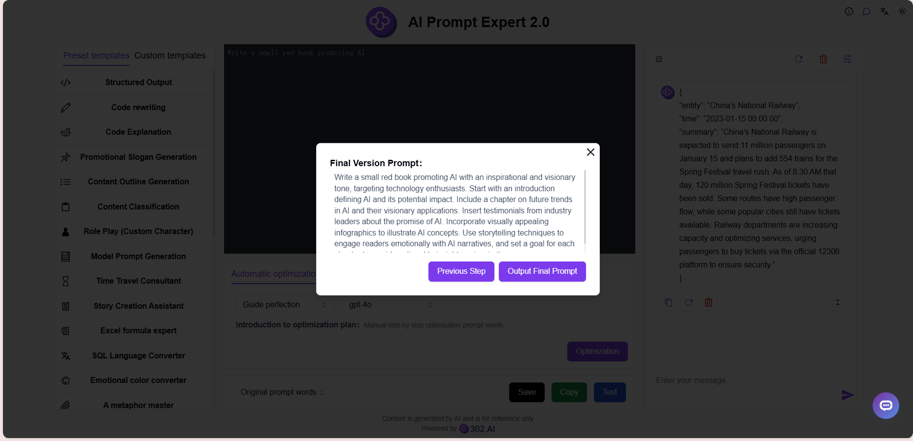

# 
🤖 AI Prompt Expert 2.0 🚀✨

AI Prompt Expert 2.0将用户简单的提示词改写成高质量的CO-STAR、CRISPE、QStar(Q*)、变分法、Meta Prompting、CoT思维链、微软优化法和RISE结构的提示词，并且可以在线修改和测试，还提供对文字生成图片的提示词优化，可一键转换为高质量的英文提示词。

<a href="README_zh.md">中文</a> | <a href="README.md">English</a> | <a href="README_ja.md">日本語</a>

The open-source version of [AI Prompt Expert 2.0](https://302.ai/en/tools/prompter/) from [302.AI](https://302.ai/en/).
You can directly log in to 302.AI to use the online version with zero code and zero configuration.
Or modify this project according to your needs, input 302.AI's API KEY, and deploy it yourself.

## Interface Preview
Simply input a basic description, and AI will generate high-quality prompts with support for online optimization and testing. Multiple preset and custom templates are available to meet your needs.
      

You can refine prompts through AI guidance, optimizing them step by step manually.
        

When AI determines that the current prompt has reached its highest quality, it will output the final prompt.

## Project Features
### ⚡ Multiple Optimization Solutions
- Supports 12 different prompt optimization solutions and provides customizable optimization framework capabilities
### 🔄 Optimization Features
- Automatic optimization: Provides multiple optimization solutions and models
- Manual optimization: Manually input desired modifications
### 🧪 Testing Features
- Online testing: Directly test prompt effectiveness
### 🤖 AI Guide Refinement
- Based on simple descriptions, manually optimize prompts step by step to generate professional prompts
### 📑 Prompt Templates
- Preset templates: Provides a rich library of preset templates
- Custom templates: Save personally frequently used prompts
### 🌍 Multi-language Support
- Chinese Interface
- English Interface
- Japanese Interface

Through AI Prompt Expert! - Transform your ideas into perfect AI instructions! 🎉💻 Let's explore the new world of AI-driven code together! 🌟🚀

## 🚩 Future Update Plans 
- [ ] Add more optimization solutions
- [ ] Add more preset templates

## Tech Stack
- React
- Tailwind CSS
- Radix UI

## Development & Deployment
1. Clone project `git clone https://github.com/302ai/302_prompt_generator`
2. Install dependencies `npm install`
3. Configure 302's API KEY (refer to .env.example)
4. Run project `npm run dev`
5. Build and deploy `docker build -t coder-generator . && docker run -p 3000:3000 coder-generator`

## ✨ About 302.AI ✨
[302.AI](https://302.ai/en/) is an enterprise-oriented AI application platform that offers pay-as-you-go services, ready-to-use solutions, and an open-source ecosystem.✨
1. 🧠 Integrates the latest and most comprehensive AI capabilities and brands, including but not limited to language models, image models, voice models, and video models.
2. 🚀 Develops deep applications based on foundation models - we develop real AI products, not just simple chatbots
3. 💰 Zero monthly fee, all features are pay-per-use, fully open, achieving truly low barriers with high potential.
4. 🛠 Powerful management backend for teams and SMEs - one person manages, many people use.
5. 🔗 All AI capabilities provide API access, all tools are open source and customizable (in progress).
6. 💡 Strong development team, launching 2-3 new applications weekly, products updated daily. Developers interested in joining are welcome to contact us.
