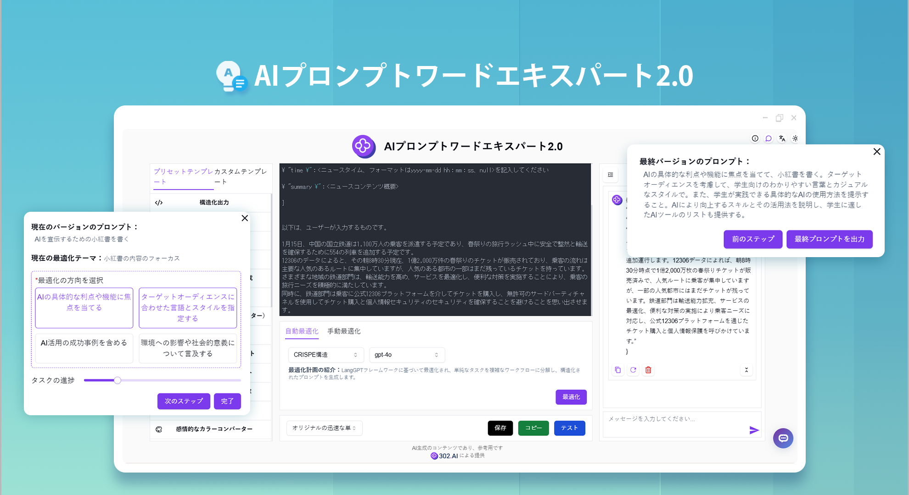

# 
🤖 AIプロンプトワードエキスパート2.0 🚀✨

AIプロンプトワードエキスパート2.0は、ユーザーの簡単なプロンプトを高品質なCO-STAR、CRISPE、QStar(Q*)、変分法、Meta Prompting、CoT思考チェーン、Microsoft最適化法、RISE構造のプロンプトに書き換え、オンラインでの修正とテストが可能です。また、テキストから画像生成のためのプロンプト最適化も提供し、ワンクリックで高品質な英語プロンプトに変換できます。

<a href="README_zh.md">中文</a> | <a href="README.md">English</a> | <a href="README_ja.md">日本語</a>

これは[302.AI](https://302.ai/ja/)の[AIプロンプトワードエキスパート2.0](https://302.ai/ja/tools/prompter/)のオープンソース版です。
302.AIに直接ログインして、コーディング不要で設定不要のオンラインバージョンをご利用いただけます。
また、このプロジェクトをご自身のニーズに合わせて修正し、302.AIのAPI KEYを設定して独自にデプロイすることも可能です。

## インターフェースプレビュー
簡単な説明を入力するだけで、AIが高品質なプロンプトを生成し、オンラインでの最適化とテストをサポートします。多様なプリセットテンプレートとカスタムテンプレートを提供し、あなたのニーズを満たします。
      

AIガイドを通じてプロンプトを改善し、手動でステップバイステップの最適化が可能です。
        

AIが現在のプロンプトが最高品質に達したと判断すると、最終プロンプトを出力します。

## プロジェクトの特徴
### ⚡ 複数の最適化ソリューション
- 12種類の異なるプロンプト最適化ソリューションをサポートし、カスタマイズ可能な最適化フレームワークを提供
### 🔄 最適化機能
- 自動最適化：複数の最適化ソリューションとモデルを提供
- 手動最適化：修正したい箇所を手動で入力
### 🧪 テスト機能
- オンラインテスト：プロンプトの効果を直接テスト
### 🤖 AIガイドによる改善
- 簡単な説明に基づき、手動でステップバイステップのプロンプト最適化を行い、最終的にプロフェッショナルなプロンプトを生成
### 📑 プロンプトテンプレート
- プリセットテンプレート：豊富なプリセットテンプレートライブラリを提供
- カスタムテンプレート：個人的によく使うプロンプトを保存
### 🌍 多言語サポート
- 中国語インターフェース
- 英語インターフェース
- 日本語インターフェース

AIプロンプトエキスパートで、あなたのアイデアを完璧なAI指示に変換しましょう！ 🎉💻 AIが駆動する新しいコードの世界を一緒に探検しましょう！ 🌟🚀

## 🚩 将来のアップデート計画
- [ ] より多くの最適化ソリューションの追加
- [ ] より多くのプリセットテンプレートの追加

## 技術スタック
- React
- Tailwind CSS
- Radix UI

## 開発とデプロイ
1. プロジェクトのクローン `git clone https://github.com/302ai/302_prompt_generator`
2. 依存関係のインストール `npm install`
3. 302のAPI KEYの設定 .env.exampleを参照
4. プロジェクトの実行 `npm run dev`
5. ビルドとデプロイ `docker build -t coder-generator . && docker run -p 3000:3000 coder-generator`

## ✨ 302.AIについて ✨
[302.AI](https://302.ai/ja/)は企業向けのAIアプリケーションプラットフォームであり、必要に応じて支払い、すぐに使用できるオープンソースのエコシステムです。✨
1. 🧠 言語モデル、画像モデル、音声モデル、動画モデルなど、最新かつ包括的なAI機能とブランドを集約
2. 🚀 基本モデルの上に深層アプリケーション開発を行い、単なるチャットボットではなく、真のAI製品を開発
3. 💰 月額料金なし、すべての機能を従量課金制で提供し、参入障壁を低く、可能性を高く
4. 🛠 チームや中小企業向けの強力な管理バックエンド、一人で管理し、多人数で利用可能
5. 🔗 すべてのAI機能にAPIアクセスを提供し、すべてのツールをオープンソースでカスタマイズ可能（進行中）
6. 💡 強力な開発チームが週に2-3個の新アプリケーションをリリース、製品は毎日更新。開発者の参加も歓迎
